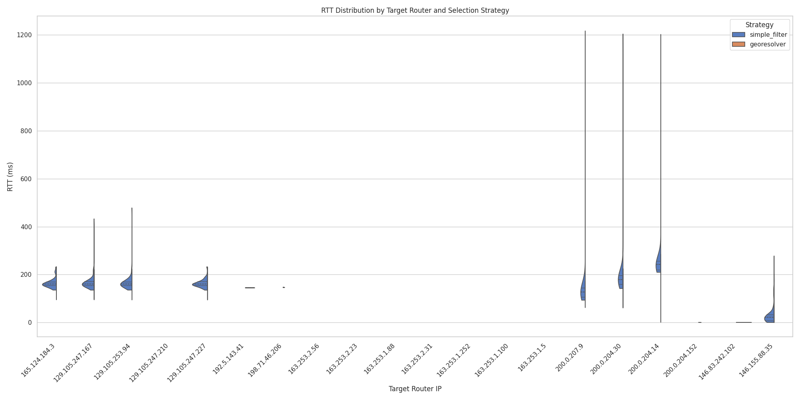

# Target Selection and Context

We chose `ialab.ing.uc.cl` (146.155.4.188), hosted by the Pontificia Universidad Católica de Chile in Santiago, as our target.

We selected this target because it is an academic server hosted directly by the university's engineering department, rather than sitting behind a sanitized commercial CDN. This exposes the raw routing infrastructure of the university and its upstream providers. We expect routing ambiguity due to the potential for educational networks to have complex peering arrangements and for international traffic to be routed through major exchange points before reaching the local Chilean network.

# Traceroute and Router Identification

We performed a traceroute from our local vantage point (Northwestern University) to the target.

### Router Sets

1.  **R_edge (Source Side)**
    The path leaves the Northwestern network through a series of 6 hops (`165.124.184.3` to `192.5.143.41`), traversing internal campus routers before handing off to the Metropolitan Research and Education Network (MREN).

2.  **R_core (Transit)**
    The core transit is handled by Internet2 and RedClara. We observe a clear path traversing the US East Coast:
    *   **Internet2 Backbone**: Chicago -> Cincinnati -> Nashville -> Atlanta -> Jacksonville.
    *   **International Gateway**: The traffic leaves the US via Miami (`i2-mia.redclara.net`), handing off to RedClara (Latin American research network).
    *   **Latin American Transit**: RedClara carries the traffic from Miami to Panama (`mia-pty`) and then to Santiago, Chile (`pty-scl`).

3.  **R_near (Destination Side)**
    Once in Santiago, the traffic enters the Chilean National Research and Education Network (REUNA) at `146.83.242.102` before finally reaching the university network (Pontificia Universidad Católica de Chile) at `146.155.88.35` and the target host.

**Limitations:**
Traceroute only reveals the forward path at a specific moment. It relies on ICMP time-exceeded messages which may be deprioritized by routers, leading to artificial latency inflation or dropped packets.

# Vantage Point Selection

We compared two probe selection strategies to measure latency to our three router sets.

1.  **Naive Selection**: We filtered for probes physically located in Chile and Argentina with IPv4 capability. This yielded 50 probes across 32 unique ASNs in 2 countries.

2.  **GeoResolver Selection**: We selected probes that showed similar DNS redirection behavior to the target network. This method aims to find probes that are topologically close, rather than just geographically close. This yielded 50 probes across 38 unique ASNs in 4 countries (Chile, Argentina, Peru, Bolivia).

**Comparison:**
The GeoResolver strategy found a more diverse set of network locations. By selecting based on network topology, we recruited probes from Peru and Bolivia that the naive filter missed, while also finding more unique observation points within the region.

# Latency Measurements and Analysis

We measured RTT from our selected probes to the defined router sets.

### Visualizing Latency

The collected RTT data was visualized using violin plots to show the distribution of latency for each router across the different probes.

### Findings

1.  **Edge Routers (`R_edge`) from Remote Probes**
    Measuring `R_edge` (Northwestern US) from South America consistently yielded high RTTs (~150-200ms+), which accurately reflects the intercontinental distance. However, we saw high variance, likely due to queuing delays at international gateways rather than the edge routers themselves.

2. **Core Routers (`R_core`) from Remote Probes**
    Measuring `R_core` (Internet2 and RedClara) from South America interestingly failed several times, indicating that the traceroute failed to reach the target router. This is likely due to the traceroute being unable to traverse the international gateways.

3.  **Near Routers (`R_near`) and "Local" Latency**
    Probes selected by the GeoResolver strategy generally showed lower minimum RTTs to `R_near` routers compared to the naive selection. This confirms that topological similarity correlates with network proximity. However, we observed cases where "near" routers still had surprisingly high latencies from some "local" probes, highlighting circuitous regional routing. Furthermore, many of

4.  **The "Last Mile" Effect**
    Early hops in the traceroute (`R_edge`) are physically close to the *source*, but when measured from our *probes* (in SA), they are the furthest. Conversely, variability in the probes' own last-mile connections (many RIPE probes are residential) introduced noise floor issues, where even "close" routers couldn't be reached faster than the probe's access link latency (e.g., DSL/Cable overhead).

5.  **Strategy Effectiveness**
    While the GeoResolver strategy successfully identified probes with better logical proximity, these probes actually exhibited **higher variability** in ping RTTs compared to the naive set. This counter-intuitive result suggests that topologically "close" networks might rely on less stable or more congested peering links than the major commercial ISPs often captured by the naive selection.

# Conclusion

Locating routers via latency is frail. While the speed of light sets a hard lower bound, routing inefficiencies, last-mile congestion, and indirect peering (circuitous paths) constantly obscure the signal. Our study confirmed that selecting vantage points based on network topology (GeoResolver) yields more reliable measurements than simple geographic selection, as physical proximity does not guarantee network proximity.
